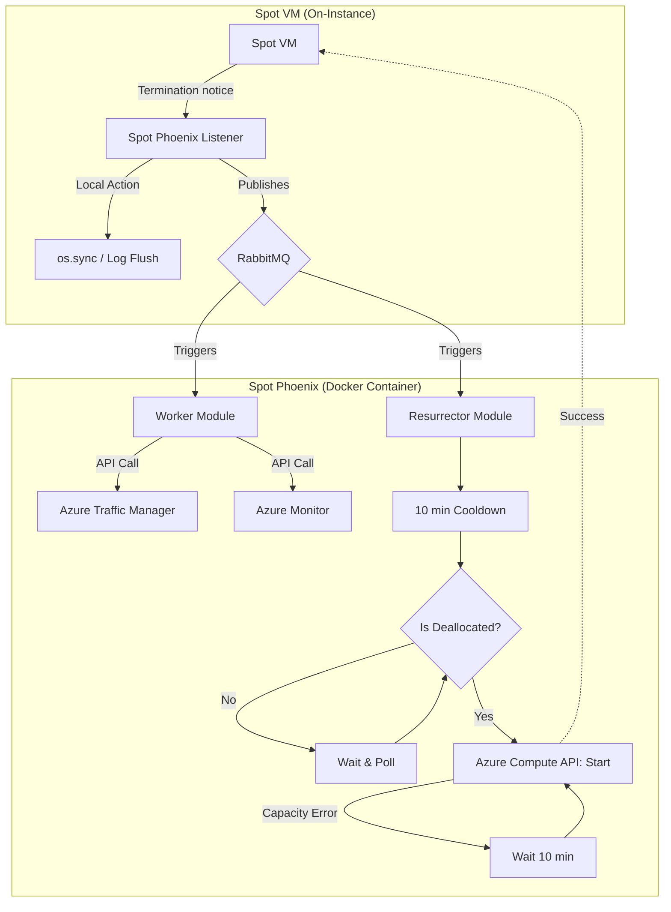

# Spot Phoenix application

## Architecture overview

### 1.Spot Phoenix Listener (On-Instance)
* Python script deployed on the Spot VM.
* Polls the Azure Instance Metadata Service (IMDS) via non-routable IP '169.254.169.254'.
* 1-second polling interval to maximize the 30 second eviction notice window.
* On eviction notice:
  * Flushes system buffers to disk (via os.sync()) to prevent data corruption
  * Signals local services for graceful shutdown (SIGTERM)
  * Publishes the eviction event to RabbitMQ

### 2. Spot Phoenix (Docker Container)
This application runs in a separate environment, consumes the RabbitMQ queue and triggers two concurrent workflows:

#### Module A : Worker
* Uses threads for tasks for time efficiency.
* Upon receiving an eviction message from RabbitMQ:
  * Updates Azure Traffic Manager to set the endpoint status to <i>Disabled</i> (using azure-mgmt-trafficmanager library).
  * Silences Azure Monitor alerts for the specific VM (using azure.mgmt.alertsmanagement library).

#### Module B : Resurrector
* Extracts <i>VM_Name</i> and <i>Resource_Group</i> from the RabbitMQ message payload.
* Ensures the VM state is <i>Deallocated </i> (via azure-mgmt-compute) before initiating the restart loop to avoid API conflicts during the eviction process.
* Wait-and-Retry loop
  * Initiates a 10-minute cooldown period after eviction
  * After the cooldown, enters a loop calling the vm.start() API
  * If capacity is unavailable, the module waits 10 minutes before retrying the start command
  * Repeats until capacity is available



### Message Schema (RabbitMQ Payload)

To ensure the application can identify the resource and execute the correct contingency measures, the Listener will publish a JSON payload using the following structure:

```json
{
  "vm_name": "spot-vm-01",
  "resource_group": "production-rg",
  "subscription_id": "00000000-0000-0000-0000-000000000000",
  "event_type": "Preempt",
  "timestamp": "2026-04-18T14:55:02Z"
}
```

### Environment configuration (.env)

To run the Spot Phoenix application, the following environment variables need to be configured. These will be used by DefaultAzureCredential to authenticate with the Azure API and to establish a connection with the message broker.

#### Azure Authentication
AZURE_SUBSCRIPTION_ID=subscription-id-uuid  
AZURE_TENANT_ID=tenant-id-uuid  
AZURE_CLIENT_ID=service-principal-app-id  
AZURE_CLIENT_SECRET=service-principal-password

#### RabbitMQ Configuration
RABBITMQ_HOST=rabbitmq-server-address  
RABBITMQ_USER=guest  
RABBITMQ_PASS=guest

#### Application Settings
POLLING_INTERVAL=1  
COOLDOWN_PERIOD=600


